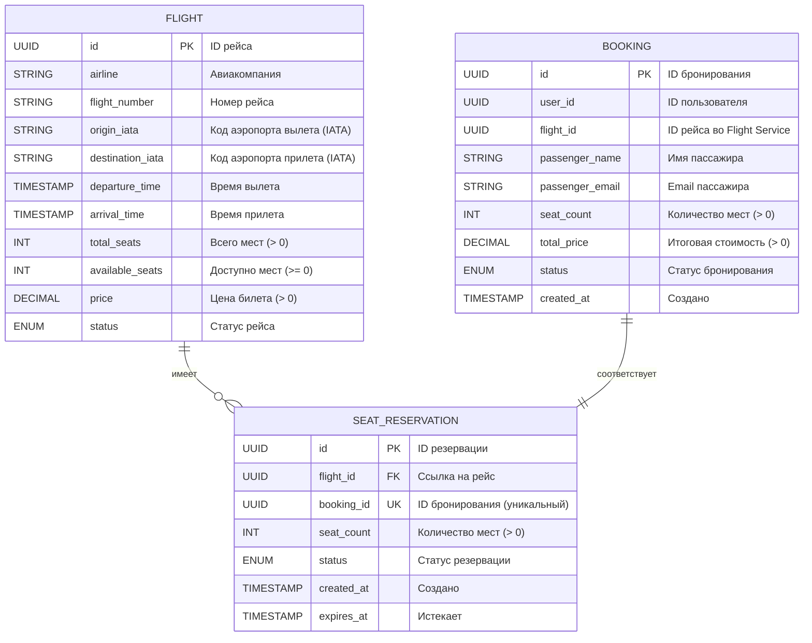

# Homework 3: Flight Booking

3NF диаграмма для сущностей сервисов `Flight Service` и `Booking Service`.

```mermaid
erDiagram
    FLIGHT {
        UUID id PK "ID рейса"
        STRING airline "Авиакомпания"
        STRING flight_number "Номер рейса"
        STRING origin_iata "Код аэропорта вылета (IATA)"
        STRING destination_iata "Код аэропорта прилета (IATA)"
        TIMESTAMP departure_time "Время вылета"
        TIMESTAMP arrival_time "Время прилета"
        INT total_seats "Всего мест (> 0)"
        INT available_seats "Доступно мест (>= 0)"
        DECIMAL price "Цена билета (> 0)"
        ENUM status "Статус рейса"
    }

    SEAT_RESERVATION {
        UUID id PK "ID резервации"
        UUID flight_id FK "Ссылка на рейс"
        UUID booking_id UK "ID бронирования (уникальный)"
        INT seat_count "Количество мест (> 0)"
        ENUM status "Статус резервации"
        TIMESTAMP created_at "Создано"
        TIMESTAMP expires_at "Истекает"
    }

    BOOKING {
        UUID id PK "ID бронирования"
        UUID user_id "ID пользователя"
        UUID flight_id "ID рейса во Flight Service"
        STRING passenger_name "Имя пассажира"
        STRING passenger_email "Email пассажира"
        INT seat_count "Количество мест (> 0)"
        DECIMAL total_price "Итоговая стоимость (> 0)"
        ENUM status "Статус бронирования"
        TIMESTAMP created_at "Создано"
    }

    FLIGHT ||--o{ SEAT_RESERVATION : "имеет"
    BOOKING ||--|| SEAT_RESERVATION : "соответствует"
```
