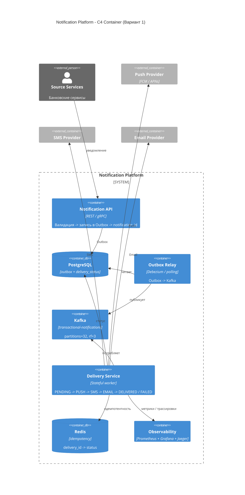
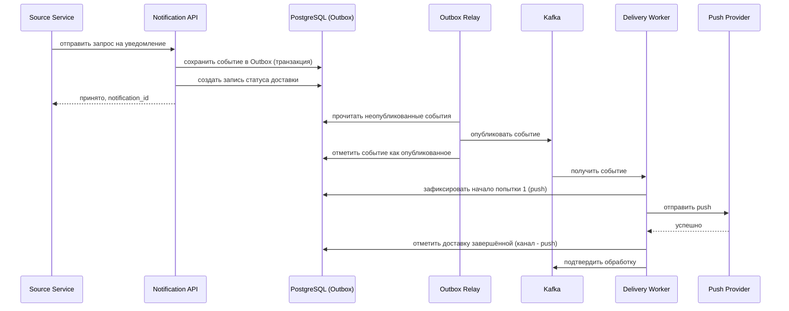
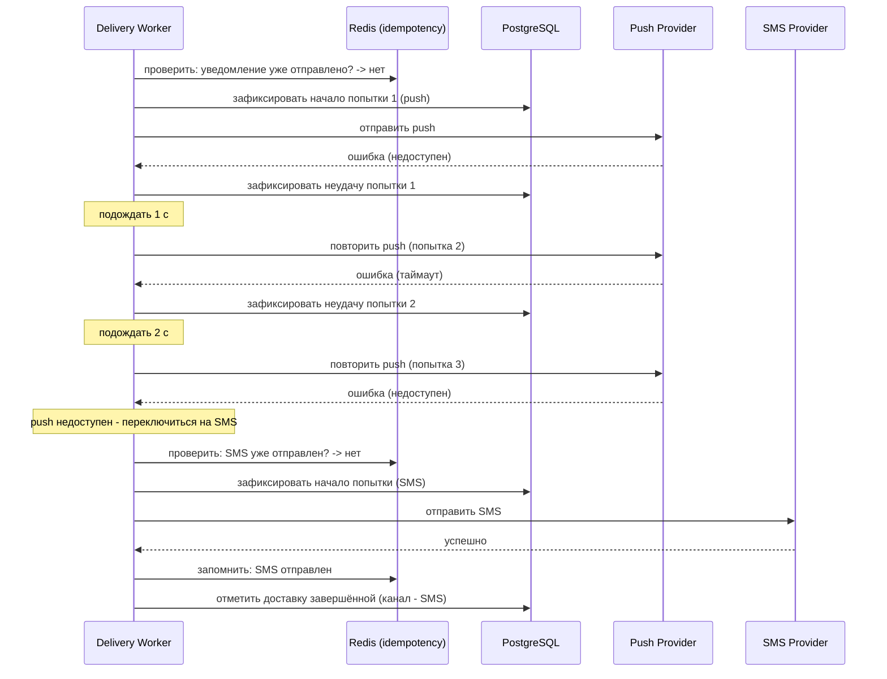
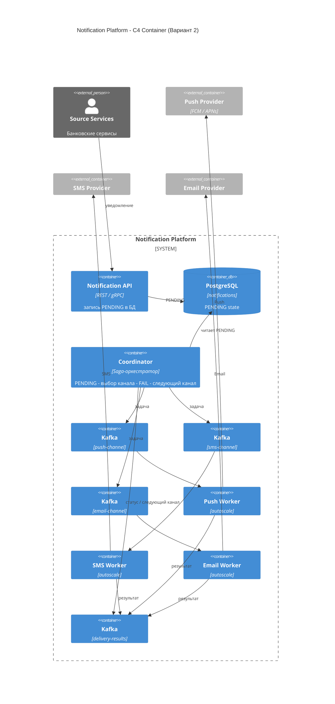
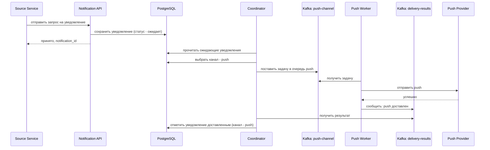
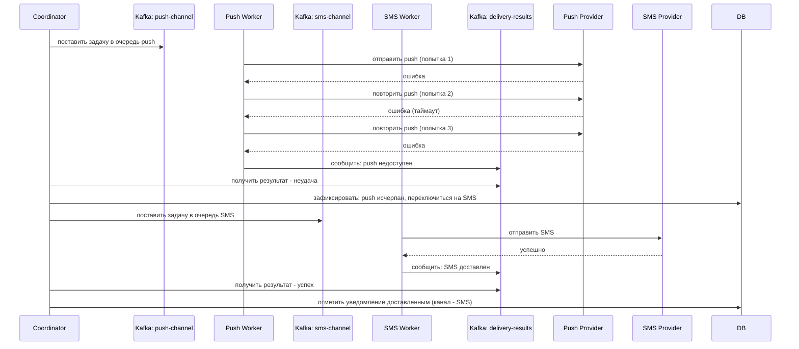

# RFC: Механизм гарантированной доставки критичных уведомлений с резервным переключением между каналами

## Оглавление

1. [Контекст](#контекст)
2. [Продуктовый анализ](#продуктовый-анализ)
3. [Пользовательские сценарии](#пользовательские-сценарии)
4. [Статистика](#статистика)
5. [Требования](#требования)
6. [Варианты решения](#варианты-решения)
7. [Сравнительный анализ](#сравнительный-анализ)
8. [Выводы](#выводы)
9. [Связанные задачи](#связанные-задачи)

---

## Контекст

### Проблема

Транзакционные уведомления (подтверждение перевода, уведомление о списании средств, OTP-коды) являются критичными: их недоставка напрямую снижает доверие пользователей к банку, провоцирует звонки в поддержку и, в случае OTP, блокирует операцию.

На текущий момент каждая команда банка отправляет уведомления самостоятельно через прямые вызовы к провайдерам. Это порождает ряд проблем:

- Уведомления теряются при временной недоступности провайдера (нет повторных попыток).
- Отсутствует автоматический переход на резервный канал (push -> SMS -> email).
- Нет единого реестра статусов: невозможно понять, дошло ли уведомление.
- При параллельных повторных попытках возникают дубли (отсутствие идемпотентности).

Данный RFC описывает подсистему **Гарантированная доставка** в рамках централизованной Notification Platform. Она обеспечивает доставку транзакционных уведомлений хотя бы через один канал с автоматическим резервным переключением, дедупликацией и полной наблюдаемостью.

### Ключевые вопросы

- Какую проблему мы решаем? Теряем транзакционные уведомления при сбоях провайдеров; нет автоматического переключения на резервный канал.
- Почему это важно сейчас? Число жалоб растёт; продуктовая аналитика прогнозирует −15 % удержания без изменений.
- Кто затронут? Все пользователи, совершающие операции (DAU 3 млн), все команды, использующие уведомления, и поддержка (снижение нагрузки на L1).

---

## Продуктовый анализ

**MAU:** 10 млн пользователей  
**DAU:** 3 млн пользователей  
**Пиковое число одновременных пользователей:** 300 000

### Влияние недоставленных транзакционных уведомлений

| Метрика | Текущее состояние | Ожидаемое улучшение |
|---------|-------------------|---------------------|
| Жалобы на недоставку | Исходный уровень (100 %) | −30 % после внедрения |
| Обращения в поддержку L1 по уведомлениям | Исходный уровень | −25 % |
| Удержание (90 дней) | Исходный уровень | +15 % (продуктовый прогноз) |

Пользователи, не получившие подтверждение перевода, с вероятностью 40 % звонят в поддержку в течение 10 минут. Каждый такой звонок стоит банку ~$2.5. При 6 M транзакционных уведомлений в день даже 1 % потерь = 60 000 инцидентов/день.

---

## Пользовательские сценарии

| Приоритет | Тип сценария | Действующее лицо | Сценарий |
|-----------|--------------|------------------|----------|
| MUST HAVE | Штатный сценарий | Пользователь | Совершает перевод -> немедленно получает push-уведомление о подтверждении (P99 <= 5 с). |
| MUST HAVE | Резервное переключение | Пользователь | Push-провайдер недоступен -> система автоматически отправляет SMS в течение 5–10 с. |
| MUST HAVE | Резервное переключение | Пользователь | Push и SMS недоступны -> система отправляет email-уведомление. |
| MUST HAVE | Дедупликация | Система | При повторной попытке или двойном вызове API уведомление доставляется ровно один раз. |
| SHOULD HAVE | Управление настройками | Пользователь | Отключает маркетинговые уведомления в приложении -> они перестают приходить; транзакционные продолжают доставляться. |
| SHOULD HAVE | Наблюдаемость | Оператор поддержки | Проверяет статус конкретного уведомления по `notification_id` в панели администратора. |
| COULD HAVE | Предпочтительный канал | Пользователь | Выбирает SMS как предпочтительный канал для транзакционных -> система начинает с SMS, а не push. |

---

## Статистика

### Расчёт нагрузки

#### Аудитория

| | |
|---|---|
| MAU | 10 000 000 |
| DAU | 3 000 000 |
| Пиковое число одновременных пользователей | 300 000 |

#### Уведомлений в день

| Тип | В день на пользователя | Итого в день |
|-----|-----------------|--------------|
| Транзакционные | 2 | 6 000 000 |
| Сервисные | 3 | 9 000 000 |
| Маркетинговые | 5 | 15 000 000 |
| Итого | 10 | 30 000 000 |

#### Средний RPS

| Тип | Расчёт | RPS |
|-----|--------|-----|
| Транзакционные | 6 000 000 / 86 400 | ~ 69 |
| Сервисные | 9 000 000 / 86 400 | ~ 104 |
| Маркетинговые | 15 000 000 / 86 400 | ~ 174 |
| Итого | | ~ 347 |

#### Пиковая нагрузка

Банковский трафик распределяется неравномерно. Чтобы система не легла в моменты массовой активности (утренние поездки, обеденный перерыв, дни выдачи зарплаты), мы закладываем инженерный коэффициент неравномерности x10 к среднему транзакционному RPS.

| Источник | RPS |
|----------|-----|
| Транзакционные (утренний пик, средний RPS * 10) | ~700 |
| Маркетинговая кампания (1 млн за 1 час) | ~278 |
| Суммарный пик (с запасом) | ~ 2 000 |

#### Хранение

| | |
|---|---|
| Объём в день | 30 000 000 уведомлений * 500 байт = 15 GB |
| Хранение 90 дней | 15 GB * 90 = 1 350 GB ~ 1,35 TB |
| С индексами и WAL (*1,5) | ~ 2 TB |

### Ёмкостное планирование (Kafka)

| | |
|---|---|
| Входящий поток | 2 000 сообщений/с * 1 KB = 2 MB/с |
| Хранение (7 дней) | 2 MB/с * 86 400 * 7 ~ 1,2 TB |
| С репликацией *3 | ~ 3,6 TB суммарно на брокеры |

---

## Требования

### Функциональные требования

| № | Приоритет | Обозначение | Требование |
|---|-----------|-------------|------------|
| 1 | MUST HAVE | FR-1 | Система принимает запросы на доставку транзакционного уведомления и возвращает `notification_id` синхронно (подтверждение приёма). |
| 2 | MUST HAVE | FR-2 | Система предпринимает не менее 3 попыток доставки через основной канал перед эскалацией. |
| 3 | MUST HAVE | FR-3 | При неудаче основного канала система автоматически переключается на резервный по приоритету: push -> SMS -> email. |
| 4 | MUST HAVE | FR-4 | Повторный запрос с тем же `notification_id` не вызывает дополнительной отправки. |
| 5 | MUST HAVE | FR-5 | Система сохраняет полный журнал попыток доставки с метками времени и результатами. |
| 6 | MUST HAVE | FR-6 | Транзакционные уведомления нельзя полностью заблокировать пользователем; можно лишь изменить предпочтительный канал. |
| 7 | SHOULD HAVE | FR-7 | Система предоставляет API для получения актуального статуса доставки по `notification_id`. |
| 8 | SHOULD HAVE | FR-8 | Система поддерживает пользовательские настройки предпочтительного канала и применяет их при выборе первого канала эскалации. |

### Нефункциональные требования

| № | Приоритет | Обозначение | Требование |
|---|-----------|-------------|------------|
| 1 | MUST HAVE | NFR-1 | Транзакционные уведомления: P99 задержки от приёма запроса до первой попытки доставки <= 5 с. |
| 2 | MUST HAVE | NFR-2 | Доступность 99,9 % (<= 8,7 ч простоя в год), измеряется по успешным ответам на входящие запросы. |
| 3 | MUST HAVE | NFR-3 | Пиковая пропускная способность >= 2 000 уведомлений/с без деградации задержки. |
| 4 | MUST HAVE | NFR-4 | Доставка не менее одного раза; дедупликация на уровне платформы обеспечивает фактически однократную доставку для конечного пользователя. |
| 5 | MUST HAVE | NFR-5 | Горизонтальное масштабирование воркеров без остановки сервиса. |
| 6 | MUST HAVE | NFR-6 | Каждая попытка доставки логируется с идентификатором трассировки; метрики (задержка, доля ошибок, доля резервных переключений) доступны в Prometheus. |
| 7 | SHOULD HAVE | NFR-7 | Стоимость: предпочтение push перед SMS, доля SMS-уведомлений при штатной работе провайдеров < 5 % от транзакционных. |

**Расчёт нагрузок:**

| Параметр | Значение |
|----------|----------|
| Пиковая нагрузка (транзакционные) | ~700 RPS |
| Целевая задержка P99 | <= 5 с (очередь + вызов провайдера) |
| Требуемая пропускная способность брокера | >= 2 000 сообщений/с |
| Пропускная способность воркера: push | >= 700 сообщ./с |
| Пропускная способность воркера: SMS | >= 200 сообщ./с |
| Пропускная способность воркера: email | >= 100 сообщ./с |

---

## Варианты решения

### Вариант 1: Outbox + Kafka + конечный автомат доставки

Единый воркер управляет всем жизненным циклом доставки одного уведомления. Событие атомарно сохраняется в Outbox-таблице PostgreSQL, затем Outbox Relay публикует его в Kafka. Воркер последовательно пробует каналы, обновляя конечный автомат в БД.

#### Архитектура (C4 Container)

#### Sequence Diagram: Штатный сценарий (push успешен)

#### Sequence Diagram: Резервное переключение (push недоступен -> SMS)

#### Соответствие ASR

| ASR | Как реализуется в Варианте 1 |
|-----|------------------------------|
| ASR-1 (Гарантированная доставка) | Outbox-паттерн: событие не теряется при падении API; Kafka с коэффициентом репликации 3; повторные попытки до исчерпания каналов. |
| ASR-2 (P99 <= 5 с) | Приоритетный топик для транзакционных; минимум шагов (Outbox -> Kafka -> воркер -> провайдер); первая попытка push в < 1 с. |
| ASR-3 (Пропускная способность) | 32 партиции Kafka; группа потребителей с автомасштабированием по отставанию; ограничитель частоты запросов к провайдерам. |
| ASR-4 (Дедупликация) | `delivery_id` как первичный ключ в `delivery_status`; кэш идемпотентности Redis перед каждой попыткой; `SELECT FOR UPDATE` при обновлении статуса. |

#### Технологии

| Компонент | Технология |
|-----------|-----------|
| Брокер | Apache Kafka (или Confluent Cloud) |
| Основная БД | PostgreSQL (outbox + delivery_status) |
| Кэш идемпотентности | Redis (TTL 24 ч) |
| Outbox Relay | Debezium (CDC) или цикл опроса (Go) |
| Воркер доставки | Go |
| Трейсинг | OpenTelemetry -> Jaeger |
| Метрики | Prometheus + Grafana |

#### Этапы реализации

| Этап | Описание | Планируемый срок | Ресурсы | Риски |
|------|----------|------------------|---------|-------|
| 1 | Notification API + Outbox Table + Outbox Relay | 3 недели | 2 бэкенд-инженера | Задержка Debezium CDC при высокой нагрузке |
| 2 | Воркер доставки с конечным автоматом + идемпотентность Redis | 3 недели | 2 бэкенд-инженера | Состояние гонки при горизонтальном масштабировании воркеров |
| 3 | Интеграция с push/SMS/email провайдерами + логика резервного переключения | 2 недели | 1 бэкенд + 1 QA | Нестабильность провайдеров в тестовой среде |
| 4 | Наблюдаемость (метрики, трассировки, оповещения) | 1 неделя | 1 DevOps | — |
| 5 | Нагрузочное тестирование + настройка | 1 неделя | 1 бэкенд + 1 QA | Выявление узких мест под пиковой нагрузкой |

#### Преимущества
- Простая операционная модель: один сервис управляет полным жизненным циклом доставки.
- Outbox гарантирует атомарность "сохранить + опубликовать" без 2PC.
- Легко отлаживать: состояние доставки видно в одной таблице.
- Низкое число компонентов = меньше точек отказа.

#### Недостатки
- Воркер доставки хранит состояние и сложнее масштабируется горизонтально без риска состояния гонки (нужен `SELECT FOR UPDATE` или закреплённое партиционирование).
- При высокой нагрузке один топик Kafka может стать узким местом (решается партиционированием).
- Debezium добавляет операционную сложность; альтернатива (цикл опроса) вносит небольшую задержку (~100 мс).

---

### Вариант 2: Очереди по каналам + координатор доставки (Saga)

Здесь мы выделяем отдельный сервис-координатор для Saga-оркестрации. У каждого канала появляется собственный Kafka-топик и независимый воркер. Координатор принимает решение о переключении канала на основе статусов, возвращаемых воркерами.

#### Архитектура (C4 Container)

#### Sequence Diagram: Штатный сценарий (push успешен)

#### Sequence Diagram: Резервное переключение (push -> SMS)

#### Соответствие ASR

| ASR | Как реализуется в Варианте 2 |
|-----|------------------------------|
| ASR-1 (Гарантированная доставка) | Координатор хранит статус в PostgreSQL; Kafka с гарантиями устойчивости хранения; воркеры повторяют попытки локально перед отправкой результата FAILED. |
| ASR-2 (P99 <= 5 с) | Асинхронный конвейер; каждый воркер канала независим, нет блокировок; пиковая задержка зависит от отставания в push-топике. |
| ASR-3 (Пропускная способность) | Независимое масштабирование каждого воркера; push-воркеры * N, sms-воркеры * M по отставанию в соответствующих топиках. |
| ASR-4 (Дедупликация) | `notification_id` как первичный ключ; координатор проверяет статус перед публикацией в топик канала; воркер использует ключ идемпотентности при вызове провайдера. |

#### Технологии

| Компонент | Технология |
|-----------|-----------|
| Брокер | Apache Kafka |
| Основная БД | PostgreSQL |
| Координатор | Go |
| Воркеры каналов | Go (отдельные деплойменты) |
| Идемпотентность | PostgreSQL уникальный индекс + Redis |
| Трейсинг | OpenTelemetry -> Jaeger |
| Метрики | Prometheus + Grafana |

#### Этапы реализации

| Этап | Описание | Планируемый срок | Ресурсы | Риски |
|------|----------|------------------|---------|-------|
| 1 | Notification API + схема PostgreSQL | 2 недели | 1 бэкенд | — |
| 2 | Сервис-координатор (Saga-оркестратор) | 3 недели | 2 бэкенд | Сложность обработки частичных сбоев в координаторе |
| 3 | Push/SMS/Email воркеры | 3 недели | 3 бэкенд | Синхронизация версий протокола между воркером и координатором |
| 4 | Наблюдаемость | 1 неделя | 1 DevOps | — |
| 5 | Нагрузочное тестирование | 1 неделя | 1 бэкенд + 1 QA | — |

#### Преимущества
- Каналы масштабируются полностью независимо (разные SLA у push vs SMS-воркеров).
- Легко добавить новый канал без изменения воркера доставки.
- Координатор явно управляет Saga — логика резервного переключения прозрачна и тестируема.

#### Недостатки
- Значительно больше компонентов: координатор + 3 * воркер + 4 * Kafka-топик.
- Координатор является единственной точкой отказа (требует отказоустойчивого деплоймента и выбора лидера).
- Задержка резервного переключения выше: результат FAILED должен пройти через Kafka -> координатор -> новый топик -> воркер.
- Более сложная отладка: нужно трассировать события через 4 топика.

---

## Сравнительный анализ

### Ресурсные требования

| Критерий | Вариант 1 (Outbox + конечный автомат) | Вариант 2 (координатор + очереди по каналам) |
|----------|---------------------------------------|----------------------------------------------|
| Время реализации | ~10 недель | ~10 недель |
| Команда | 3 инженера | 4–5 инженеров |
| Инфраструктура | 1 Kafka cluster, 1 PostgreSQL, 1 Redis | 1 Kafka cluster (4 топика), 1 PostgreSQL, 1 Redis |
| Количество сервисов | 3 (API, Relay, воркер) | 5 (API, координатор, push-воркер, SMS-воркер, email-воркер) |
| Операционная сложность | Средняя | Высокая |

### Соответствие требованиям

| Требование | Вариант 1 | Вариант 2 |
|------------|-----------|-----------|
| FR-1 (приём запроса) | ✅ | ✅ |
| FR-2 (3 попытки) | ✅ | ✅ |
| FR-3 (резервное переключение push->SMS->email) | ✅ | ✅ |
| FR-4 (дедупликация) | ✅ | ✅ |
| FR-5 (журнал попыток) | ✅ | ✅ |
| NFR-1 (P99 <= 5 с) | ✅ | ✅ (задержка резервного переключения выше) |
| NFR-2 (доступность 99,9 %) | ✅ | ✅ (координатор — единственная точка отказа без HA) |
| NFR-3 (2 000 сообщений/с) | ✅ | ✅ |
| NFR-4 (не менее одного раза + дедупликация) | ✅ | ✅ |
| NFR-5 (горизонтальное масштабирование) | ✅ (закреплённое партиционирование) | ✅ (независимое по каналам) |
| NFR-6 (наблюдаемость) | ✅ | ✅ |

### Анализ компромиссов

| Параметр | Вариант 1 | Вариант 2 |
|----------|-----------|-----------|
| Задержка резервного переключения | Низкая (~1–2 с: повторные попытки в памяти воркера) | Выше (~3–5 с: round-trip через Kafka + координатор) |
| Операционная сложность | Низкая (3 сервиса) | Высокая (5+ сервисов, 4 топика) |
| Независимое масштабирование каналов | Ограниченное (один воркер) | Полное (отдельные деплойменты) |
| Прозрачность логики резервного переключения | Средняя (конечный автомат в коде) | Высокая (координатор явно оркестрирует) |
| Стоимость добавления канала | Средняя (добавить шаг в конечный автомат) | Низкая (новый воркер + топик) |
| Риск дублирования сообщений | Низкий (Redis + блокировка в БД в одном сервисе) | Средний (состояние гонки координатор <-> воркер) |

---

## Рекомендация

Выбираем Вариант 1 (Outbox + Kafka + конечный автомат доставки).

Он переключается между каналами быстрее (~1–2 с против ~3–5 с у Варианта 2), так как резервное переключение происходит внутри воркера без дополнительного round-trip через Kafka. При целевом P99 <= 5 с это критично.

Операционно три сервиса поддерживать проще, чем пять. Меньше точек отказа, проще отладка и дешевле старт. Паттерн Outbox даёт атомарность сохранения и публикации без распределённых транзакций, а конечный автомат в одном сервисе исключает состояния гонки между координатором и воркером.

При текущем пике в 2 000 сообщений в секунду независимое масштабирование каналов не требуется. Закреплённое партиционирование по `user_id` справится с объёмом без усложнения архитектуры.

**В каких случаях Вариант 2 окажется лучше:**
- Пиковая нагрузка превысит 10 000 сообщений/с и потребует существенно разных ресурсов для push и SMS воркеров.
- Появятся сложные правила маршрутизации (A/B-тесты, многоуровневые приоритеты провайдеров).
- Число каналов вырастет до пяти и более (например, добавятся WhatsApp и Telegram).

**Что мы теряем при таком выборе:**
Закреплённое партиционирование ограничивает параллелизм воркеров числом партиций Kafka (32). Если потребуется больше 32 воркеров, придётся мигрировать партиционирование.
Debezium как Outbox Relay добавляет операционные накладные расходы. Альтернативный вариант с циклом опроса вносит задержку около 100 мс, что вполне укладывается в P99 <= 5 с.
Кэш идемпотентности Redis даёт лишь мягкую гарантию. При его полной потере возможна повторная доставка, но для нашей модели "не менее одного раза" это приемлемо.

